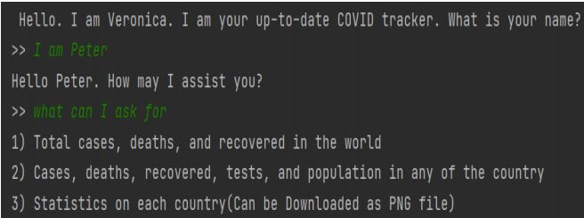
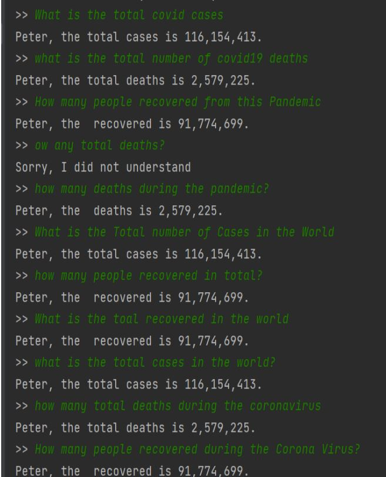
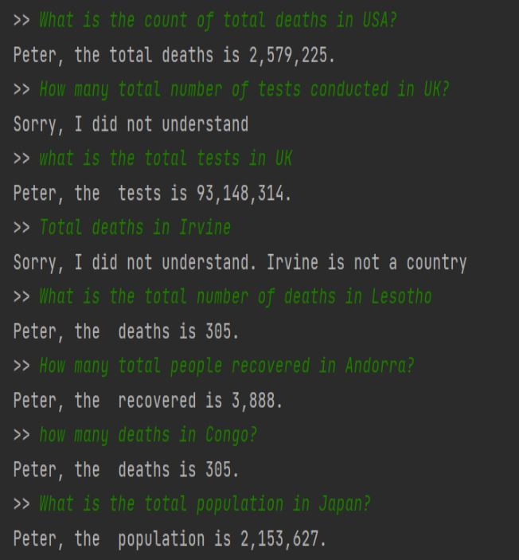

# Anything About Covid19 - Chatbot Application

# Overview
Corona Virus is the talk of the hour currently. It has affected so many lives all 
around the world. It has altered the livelihood of people. It has become a part of our 
daily lifestyle. In the same instance, some people do not have any information about 
how COVID-19 has affected. I created a chatbot that responds to queries 
regarding the Corona Virus data to get the live status. It is a user-friendly platform, so that people of any category can easily interact with it.

# Implementation Example

